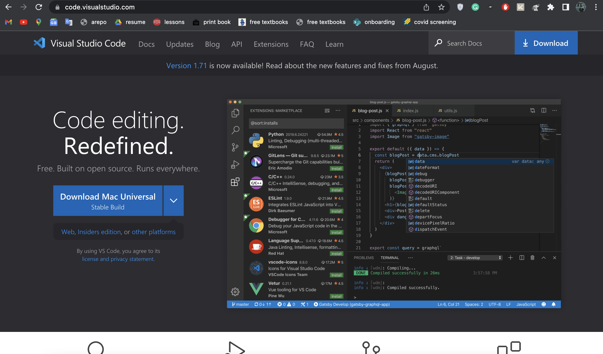
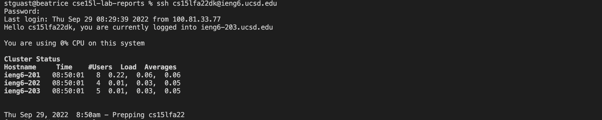
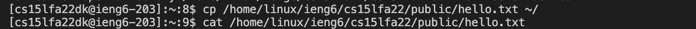
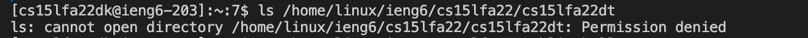
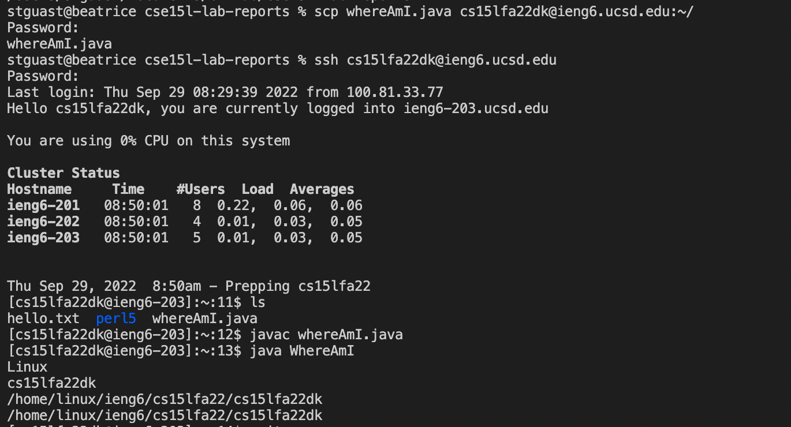
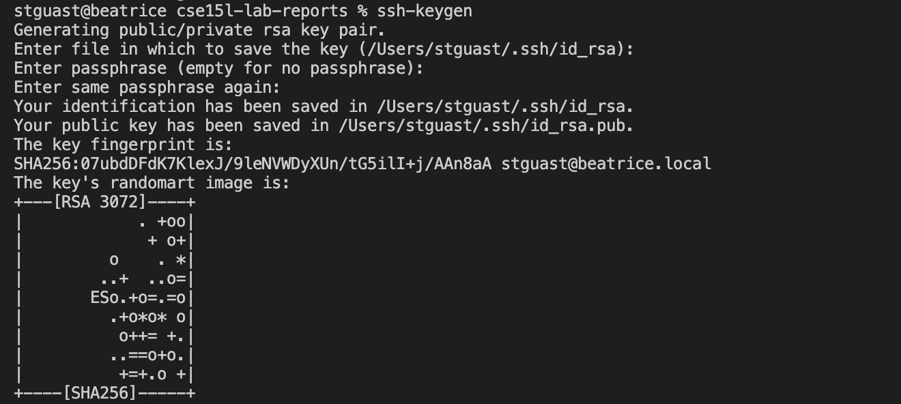
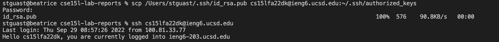
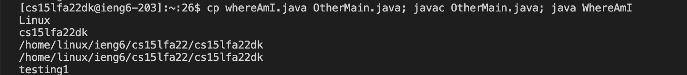

# how to log into ieng6
**Installing VScode**<br>
Firstly, make sure to install Visual Studio Code. I already had mine installed, but it is easily downloadable from the following site: <br>
 <br><br>
**Remotely Connecting**<br>
Next, run the following command in your terminal on VSC with the `dk` replaced by the letters in your account. My letters are dk, so this command works for me. 
```
$ ssh cs15lfa22dk@ieng6.ucsd.edu
```
It should produce something similar to the following screenshot: <br>
 <br><br>
**Trying Some Commands**<br>
We can try a few commands after logging into the remote server. `cp` and `cat` in particular copy and print a file, we can see this in action below. <br>
<br>
Make sure to stick to your own account. If commands are attempted with another user's account, the terminal will print an error message. <br>
<br><br>
**Moving Files with `scp`**<br>
To copy files from your computer to a remote computer, run the following command in your personal terminal (do **not** log into the ieng6 just yet).
```
$ scp WhereAmI.java cs15lfa22dk@ieng6.ucsd.edu:~/
```
That's it! After logging back into the ieng 6, you will now be able to view the file in your home directory using `ls` and run the same program with `javac` and `java` commands. Here's a sample of this entire process in action.
<br><br>
**Setting an SSH Key**<br>
Fortunately, there's a way to skip entering a password every time we want to use the remote server. To set up SSH keys, use the following command in your personal terminal. 
```
$ ssh-keygen
```
When asked for the file in which to save the key, passphrase, and passphrase again, just click return-- don't type anything. 
<br>
To finish up, log back into the remote server to copy the public key to the .ssh directory with the following commands:
```
$ ssh cs15lfa22dk@ieng6.ucsd.edu
<password>
```
```
mkdir .ssh
exit
```
Back on your personal terminal, type the following command. Make sure to change the `stguast` to your own user and the `dk` as well.
```
scp /Users/stguast/.ssh/id_rsa.pub cs15lfa22dk@ieng6.ucsd.edu:~/.ssh/authorized_keys
```
From the following screenshot, we can see that after running those commands I can log into the remote server without a password.
<br><br>
**Optimizing Remote Running**<br>
Now that we no longer need a password to use the remote server, we can further optimize this process. I like to use the `up arrow` on my keyboard to access previous commands without having to retype them. I also recently learned to use semicolons to run many commands on the same line in my terminal:



