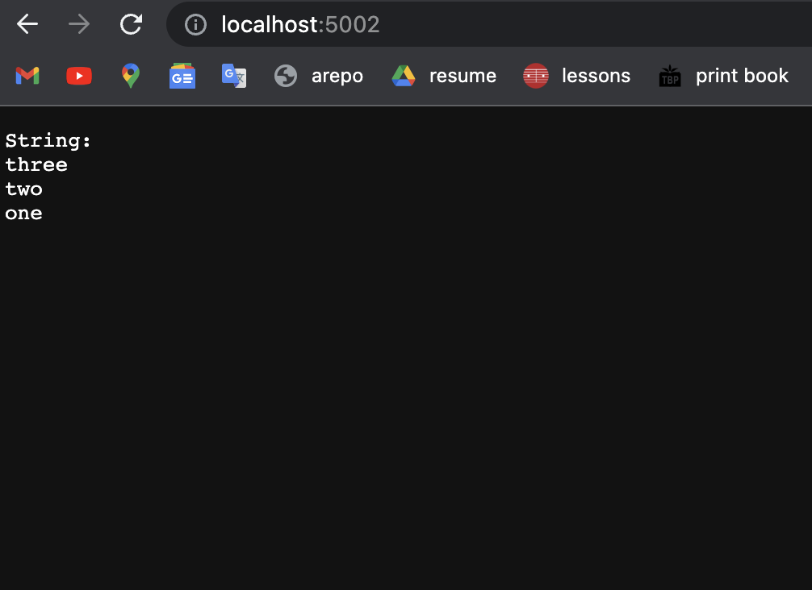
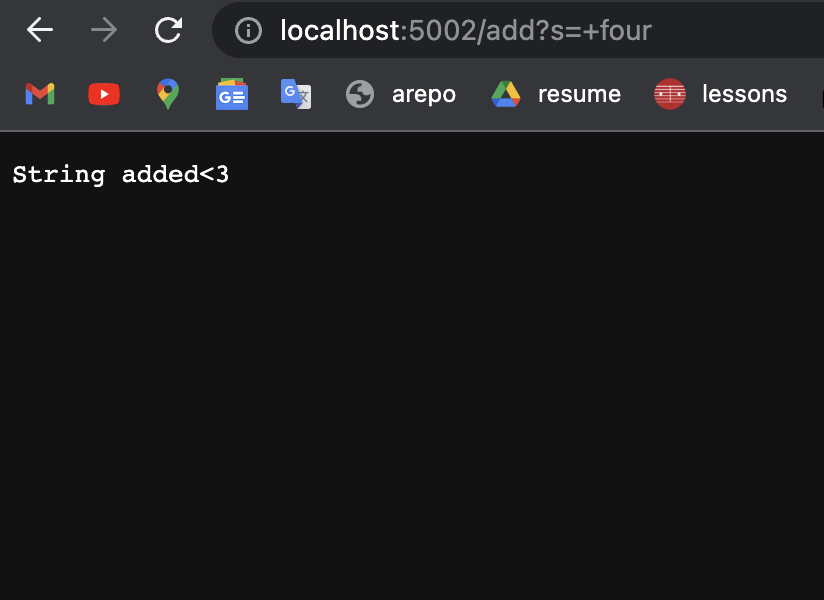
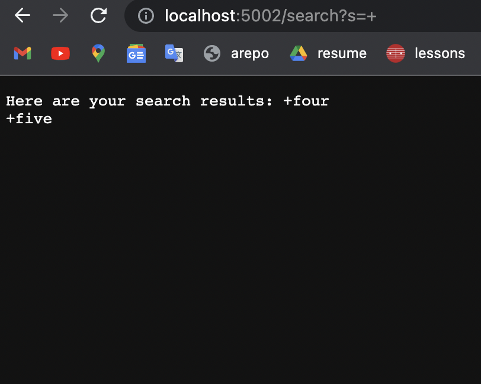
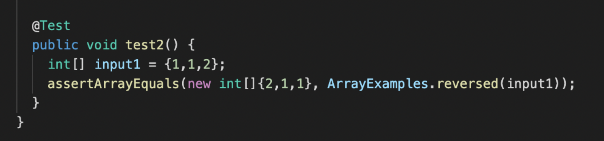
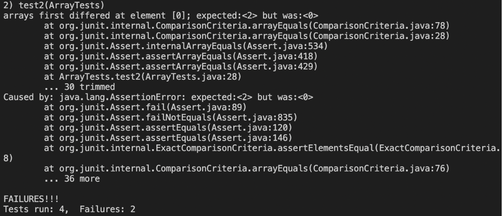
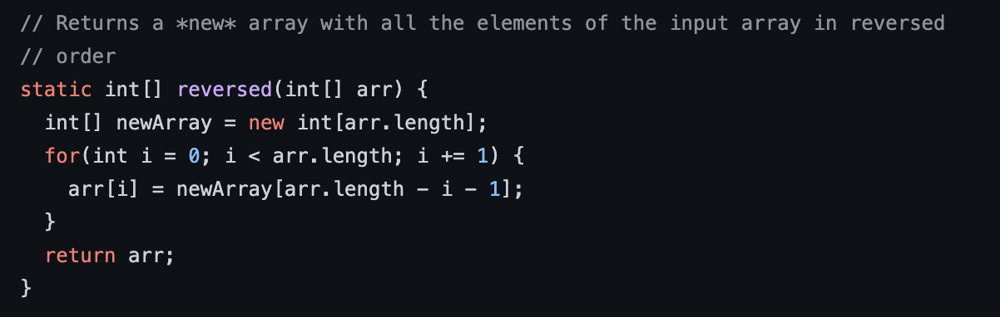
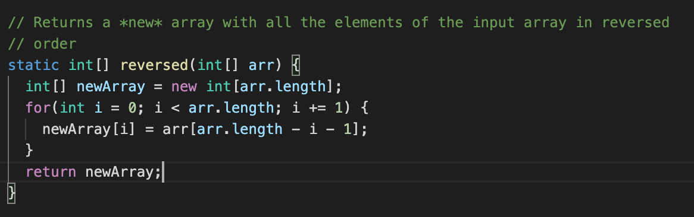
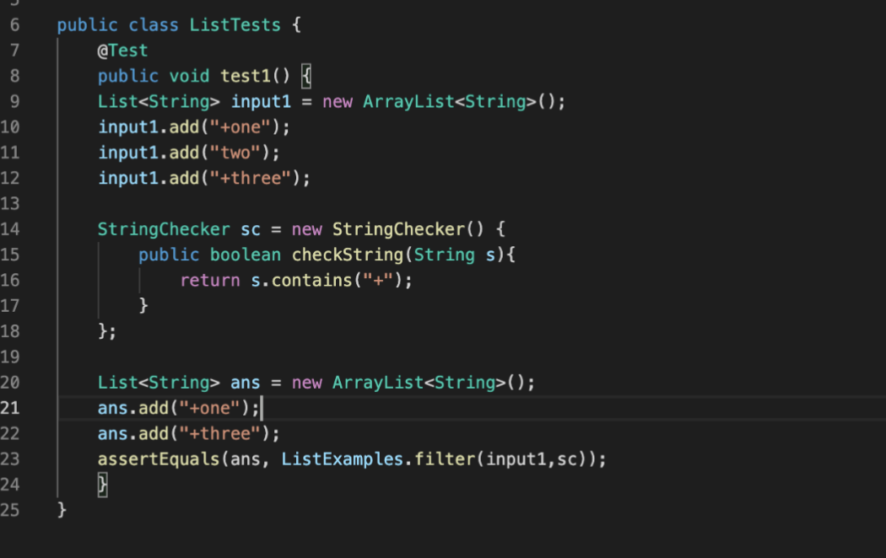
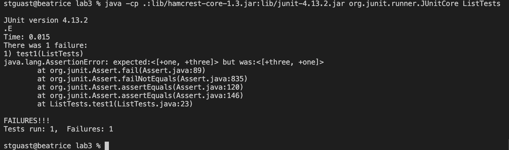

# week 3 lab report
**part 1**<br>
```
import java.io.IOException;
import java.net.URI;

class Handler implements URLHandler {
    String str = "String:\n";
    public String handleRequest(URI url) {
        if (url.getPath().equals("/")) {
            return str;
        } else {
            System.out.println("Path: " + url.getPath());
            if (url.getPath().contains("/add")) {
                String[] parameters = url.getQuery().split("=");
                str += parameters[1]+"\n";
                return String.format("String added<3");
            }
            if (url.getPath().contains("/search")){
                String newstr = "Here are your search results: ";
                String[] parameters2 = url.getQuery().split("=");
                String[] filter = str.split("\n");
                for (int i=0; i<filter.length; i++){
                    if (filter[i].contains(parameters2[1])){
                        newstr += filter[i]+"\n";
                    }
                }
                return newstr;
            }
            return "404 Not Found!";
        }
    }
}

class SearchEngine {
    public static void main(String[] args) throws IOException {
        if(args.length == 0){
            System.out.println("Missing port number! Try any number between 1024 to 49151");
            return;
        }

        int port = Integer.parseInt(args[0]);

        Server.start(port, new Handler());
    }
}
```

`Method called:` handleRequest<br>
`Values of relevant arguments, values of any relevant fields of the class:` url- url that we type in. The method recognizes "/" and loads the whole list of strings (no add or search yet!)<br>
`How values change by the time request is done processing:`n/a<br><br>

 
`Method called:` handleRequest<br>
`Values of relevant arguments, values of any relevant fields of the class:` url- url that we type in. The method recognizes "/add", gets the string we want with .split("="), storing that in parameters[1], and adding it to the list. <br>
`How values change by the time request is done processing:` Before telling the user that their String has been added, the program will update the string list by adding the string and a line break. <br><br>


`Method called:` handleRequest<br>
`Values of relevant arguments, values of any relevant fields of the class:` url- url that we type in. The method recognizes "/search" and gets the substring we want to check for with .split("="), storing that in parameters2[1]. The program then creates an array made up of each individual String from the list with .split("\n") and runs a for loop to check if each String contains the substring. <br>
`How values change by the time request is done processing:` Before returning the new string, the program will reset whatever the old string list was by setting newstr to the opening message "Here are your search results." Then it will add the new values to newstr and return that when its done. <br><br>

**part 2**<br>

*failure inducing input*<br><br>

*symptom*<br><br>

*bug - line arr[i] = newArray[arr.length - i - 1];*<br><br>

*bug fixed*<br>
The bug caused this particular symptom because while a new array was created, it was not updated, so all the values remained at 0. arr and newArray were switched.<br><br>

*failure inducing input*<br><br>

*symptom*<br><br>

*bug*<br><br>
The bug caused this particular symptom because it told the program to add the result to the index 0, which pushed the result to the front of the list and reversed the order that they appeared in the input list. To fix this, I simply deleted the 0.

