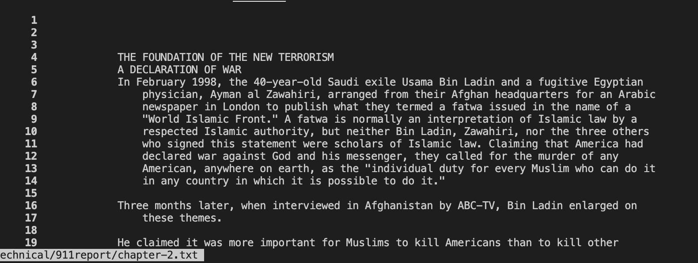
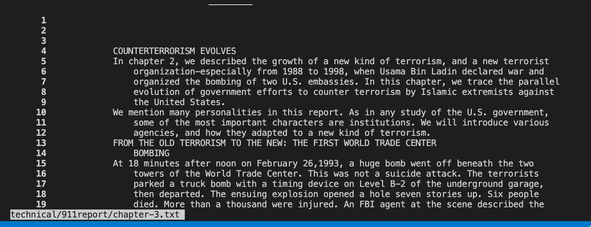
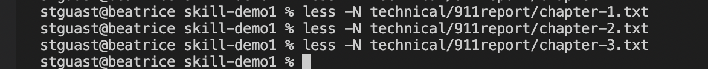
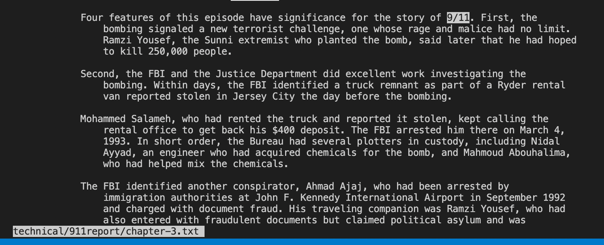
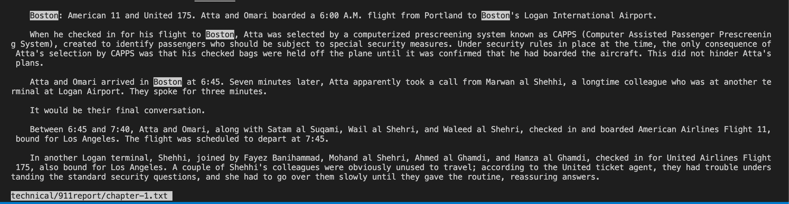
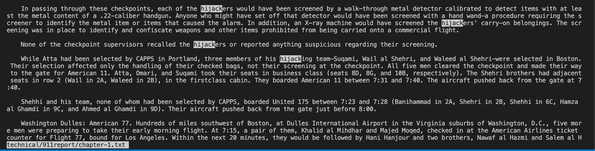
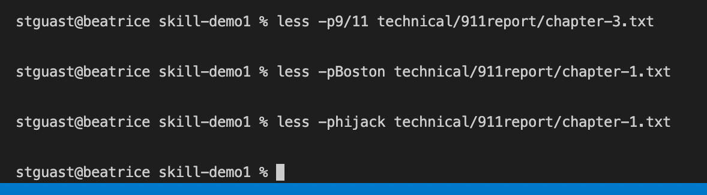

# week 5 lab report
**-name command** 
 
This command finds the file with the specified name and prints out the pathway to the file. It is useful for checking to see if you have a file with that name and where it is located. 
**-N command** 

 
This command displays the line numbers of the text, which is useful for keeping track of where you are in the text so that you don't lose your place or always have something to refer back to. 
**-p command** 

 
This command highlights a keyword in the text for you, it works similar to a control+F command, which is useful if you're looking for a specific word in the text.