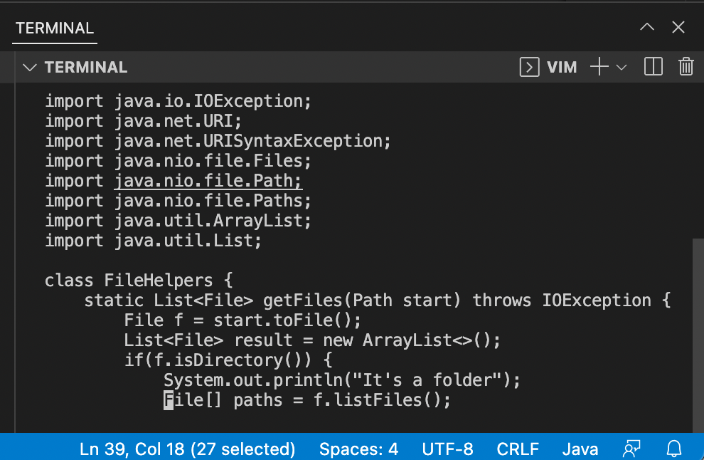
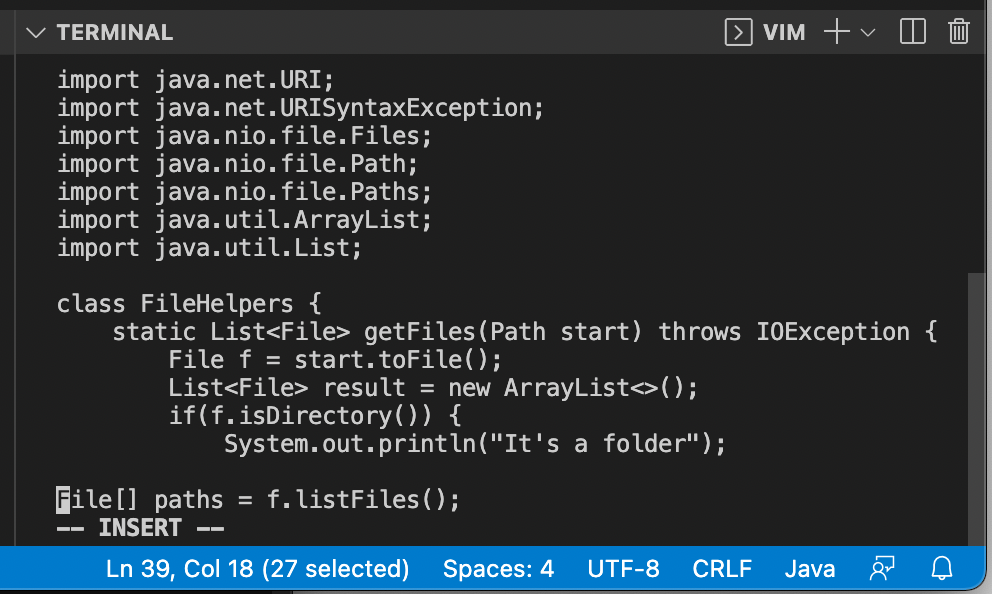
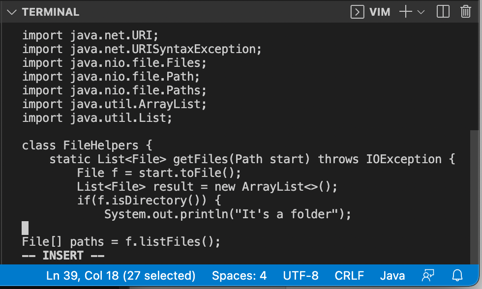
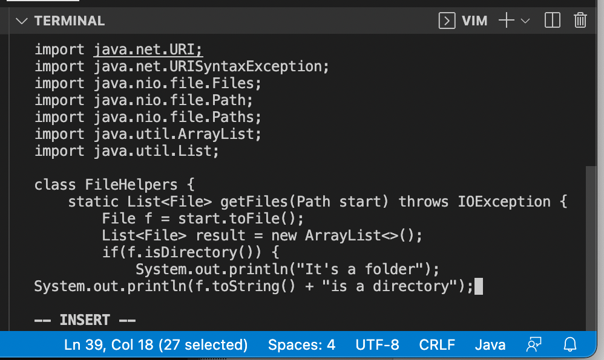
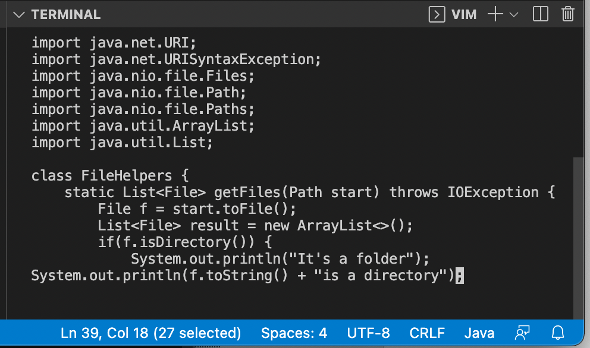
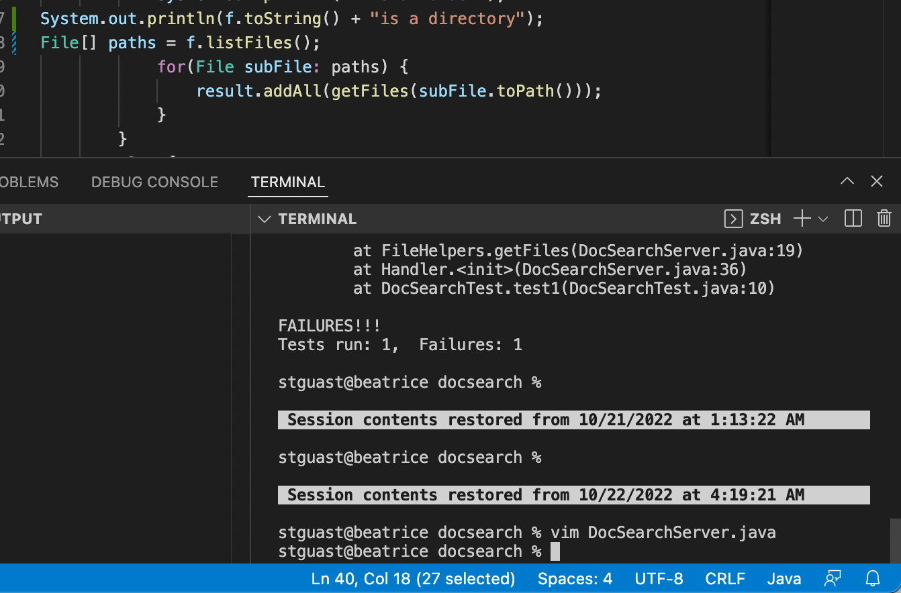

# week 7 lab report
**PART ONE** 
`/File[]<Enter>I<Enter><Esc>kISystem.out.println(f.toString() + "is a directory");<Esc>:wq<Enter>`

 
Here I type `/File[]<Enter>` and the cursor jumps to the start of `/File[]`. 

 Here I type `I` to go into Insert Mode and press `<Enter>` to create a space for my line. 

 Here I type `<Esc>` to exit Insert Mode, going into Normal Mode. Then I press `k` to move up a line, and `I` to go back into Insert Mode.  

 Here I type the command we were told to insert: `System.out.println(f.toString() + "is a directory");` 

 I press `I` to exit Insert Mode. 

 Then I press `:wq<Enter>` to write and quit; as you can see from the screenshot, the command has been added to my file.   

**PART TWO** 
First style: 147 seconds 
Second style: 62 seconds 
I forgot to copy paste the appropriate scp command so the first style took me a little longer!  
I prefer being already logged into an ssh session (second style) and making the edit in Vim; I think it's a lot more time efficient than copying the file over, logging in, and running it.   
If the project requires several lengthy edits, I might choose the first style since I'm not too used to vim yet and writing the edits directly into the file would be quicker for me for now.