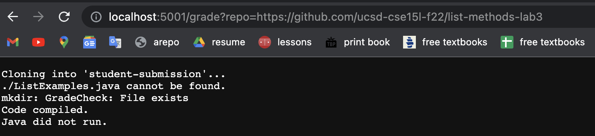
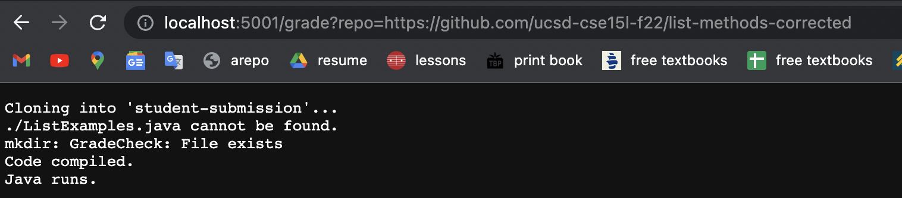
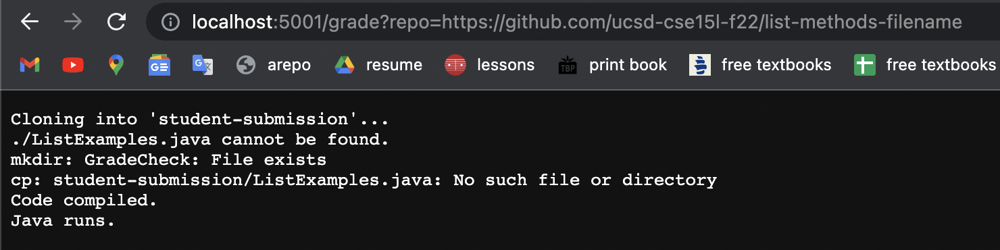

# week 9 lab report
```
rm -rf student-submission
git clone $1 student-submission

FILE=./ListExamples.java
if test -f "$FILE";
then 
  echo "You have $FILE."
else 
  echo "$FILE cannot be found."
fi 

mkdir GradeCheck
cp student-submission/ListExamples.java TestListExamples.java GradeCheck
cp -r lib GradeCheck

cd GradeCheck
javac -cp .:lib/hamcrest-core-1.3.jar:lib/junit-4.13.2.jar *.java
if [ $? -eq 0 ]
then 
  echo "Code compiled."
else
  echo "Code did not Compile."
  exit 1
fi

java -cp .:lib/hamcrest-core-1.3.jar:lib/junit-4.13.2.jar org.junit.runner.JUnitCore TestListExamples > testresults.txt
if [ $? -eq 0 ]
then
  echo "Java runs."
else
  echo "Java did not run."
fi
```




<br><br>
**Trace for Screenshot 1**<br>
`echo $FILE cannot be found`: stdout is "$FILE cannot be found.", stderr is none, return code is zero.<br>
`mkdir GradeCheck`: stdout is none, stderr is none, return code is zero.<br>
`javac -cp...`: stdout is none, stderr is none, return code is zero.<br>
`echo "Code compiled"`: stdout is "Code compiled.", stderr is none, return code is zero.<br>
`java -cp...`: stdout is JUnit version 4.13.2
.E
Time: 0.015
There was 1 failure:
1) test1(TestListExamples)
java.lang.AssertionError: expected:<[+one, +three]> but was:<[+three, +one]>
	at org.junit.Assert.fail(Assert.java:89)
	at org.junit.Assert.failNotEquals(Assert.java:835)
	at org.junit.Assert.assertEquals(Assert.java:120)
	at org.junit.Assert.assertEquals(Assert.java:146)
	at TestListExamples.test1(TestListExamples.java:23)

FAILURES!!!
Tests run: 1,  Failures: 1, <br>stderr is none, return code is not 0. <br><br>
`if test -f "$FILE";`: false. File was not found.<br>
`if [ $? - eq 0 ]`: true. javac -cp compiled successfully so `$?` did equal 0 and the if statement is then true.<br>
`if [ $? - eq 0 ]`: false. java -cp did not run so `$?` didn't equal 0 and the if statement is false. 
<br><br>
*DID NOT RUN*: `echo "You have $FILE."`, `echo "Code did not compile."`, `exit 1`, `echo "Java runs."`